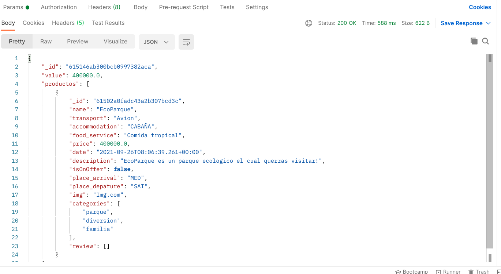

# Cart

Este microsevicio va a ser el correspondiente a manejar el carrito de compras y el proceso de pago.

Para poner en funcionamiento el microservico se debe dirigir a la carpeta cart y ejecutar los siguientes comandos:

```bash
mvn clean install
mvn spring-boot:run
```

## Funcionalidades Cart

###  Agregar productos

Sirve para agregar un producto en específico al carrito de compras con un id específico, esté puede ser accedido por el siguiente endpoint.

```bash
localhost:8080/cart/{id}
```



### Eliminar productos

Este trae productos que coincidan con una lista de posibles valores dados. Para acceder a este se debe dirigir al siguiente endpoint:

```bash
localhost:8080/products/cart?removeProductId={id}
```


### Obtener el carrito de un Usuario

Este sirve para obtener el carrito de compras del usuario de la sesión actual. Para acceder a este se debe dirigir al siguiente endpoint con estos headers:
```bash
localhost:8080/cart
```


### Payment

Este se utiliza para proceder al pago de los productos en el carrito de compras del usuario. Para acceder a este se debe dirigir al siguiente endpoint con estos headers:

```bash
localhost:8080/cart/payment
```

