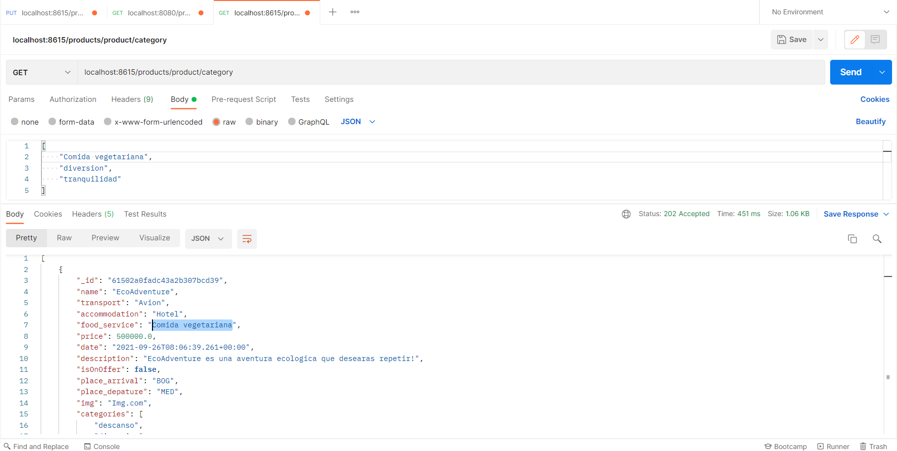

# Publication

Publication va a ser el encargado de manejar las publicaciones, dsde la publicacion hasta el manejo de preguntas y filtrado.

Para poner en funcionamiento el microservico se debe dirigir a la carpeta publication y ejecutar los siguientes comandos:

```bash
mvn clean install
mvn spring-boot:run
```

## Funcionalidades Publication

###  Traer producto por id

Sirve para obtener un producto en especifico y su información este puede ser accedido en el siguiente endpoint.

```bash
localhost:8080/products/product/{id}
```


### Filtro de resultados

Este trae productos que coincidan con una lista de posibles valores dados. Para acceder a este se debe dirigir al siguiente endpoint:

```bash
localhost:8080/products/product/{category}
```



### Agregar una pregunra

Este agrega una pregunta a una producto existente. Para acceder a este se debe dirigir al siguiente endpoint con estos headers:

```bash
localhost:8080/products/product
```


Continúe con [Cart](cart.md)
