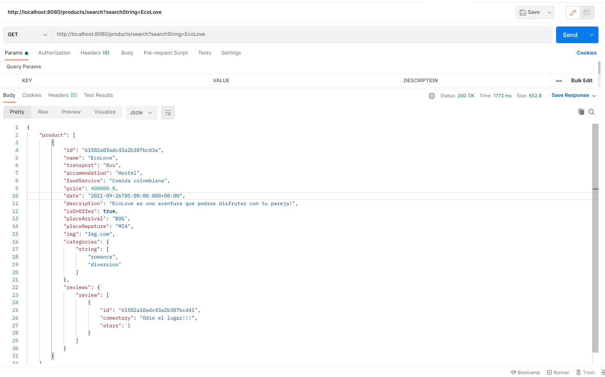

# Seeker

El Seeker va a ser el encargado de realizar la búsqueda de productos este cuenta con un microservicio y un consumidor que actúa como proxy 

## Microservicio

Para poner en funcionamiento el microservico se debe dirigir a la carpeta seeker y ejecutar los siguientes comandos:

```bash
mvn clean install
mvn spring-boot:run
```

## Consumidor

Para el consumidor del servicio se debe dirigir a la carpeta seekerMiddleware y ejecutar los siguientes comandos:

```bash
mvn clean install
mvn spring-boot:run
```

## Funcionalidades Seeker

###  Microservicio - Buscar un producto

Este microservicio al funcionar por SOAP no puede ser accedido directamente, pero cumple con la funcionalidades de buscar.

### Consumidor - Buscar un producto

Este ya puede ser accedido, ya que se encarga de consumir el servicio previamente mencionado y traducir la respuesta de tal manera que sea entendible al servidor. Para acceder a este se debe dirigir al siguiente endpoint:

```bash
localhost:8080/products/search?serachString={string}
```



Continúe con [Authentication](authentication.md)
